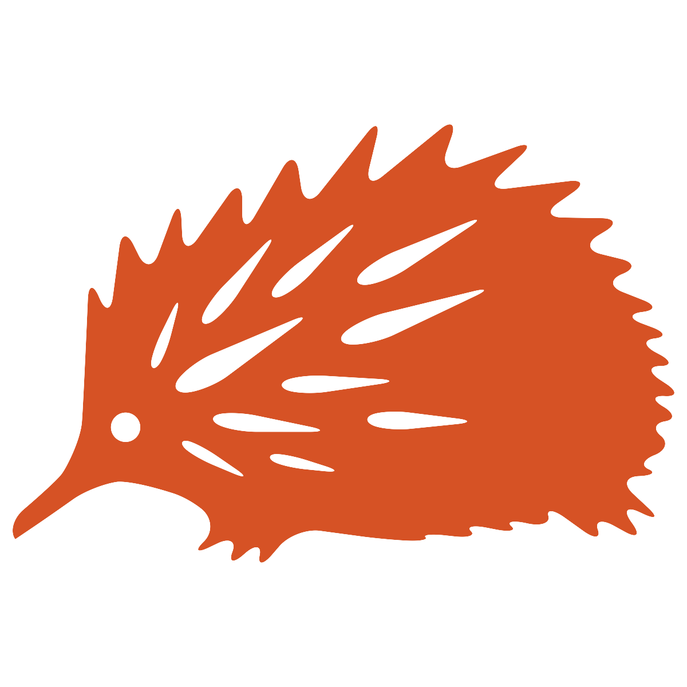

<!-- README.md is generated from README.Rmd. Please edit that file -->

# yinarlingi 

## Overview

The purpose of yinarlingi is to provide a set of convenience functions
for validating Warlpiri dictionary data. Essentially, it pre-configures
various functions from [tidylex](https://coedl.github.io/tidylex/) and
[tidyverse](https://www.tidyverse.org/) packages with values specific to
the Warlpiri dictionary data, so that those within the Warlpiri
dictionary project can quickly run and re-run frequently used routines
(e.g. data validation, derived views), and also so that these tests can
be run in a Continuous Testing (CT) environment such as GitLab
pipelines.

Yinarlinigi is the Warlpiri word for echidna.

## Installation

You can install yinarlingi from github with:

``` r
# install.packages("devtools")
devtools::install_github("CoEDL/yinarlingi")
```

## Examples

### Read in the Warlpiri lexicon into a data frame

The Warlpiri dictionary consists of a large plain text file of the form
(where `\me` stands for main entry; see [full list of
codes](https://github.com/CoEDL/yinarlingi/blob/master/inst/structures/wlp_code-definitions.csv)):

    \me jampaly(pa) (N) (PV): (La,Wi,Y)
    \dm spatial: tactile: \edm
    \gl sharp, pointed \egl
    \rv sharp \erv
    \eg
    \we Karlangu ka karri jampalypa ngulaju yiri-nyayirni. \[@@]
    \et The digging stick is sharp, that is very sharp pointed. \ewe
    \eeg
    \ant jampilypa, munju \eant
    \cf jaarn-karri-mi, lirra jampalypa \ecf
    \syn jalkarra, larrilpi, yiri \esyn
    \eme
    \sse jampaly-pi-nyi (V):
    \def xERG cause y to come to be sharp (<jampalypa>) \edef
    \gl sharpen, trim to ^point \egl
    \rv sharpen \erv
    \eg
    \we Jampaly-pungulpalu wangkinypa, yangka kuja munju-jarrija. \[@@]
    \et They sharpened the stone-axe which had became blunt. \ewe
    \we Karlangulu jampalypa-pungu. \[Tiger Jakamarra]
    \et They sharpened the points of the digging sticks. \ewe
    \eeg
    \csl YSL#1336, YSL#313 \ecsl
    \syn yiri-ma-ni \esyn
    \esse
    
    ...

We can use the `read_wlp_lexicon` function to read such data into a data
frame:

``` r
library(yinarlingi)
#> Loading required package: tidylex
#> Loading required package: dplyr
#> 
#> Attaching package: 'dplyr'
#> The following objects are masked from 'package:stats':
#> 
#>     filter, lag
#> The following objects are masked from 'package:base':
#> 
#>     intersect, setdiff, setequal, union
#> Loading required package: V8
#> Loading required package: stringr
#> Loading required package: tidyr

# Yinarlingi provides a 'mini lexicon' with a few entries as extra data
# Use system.file to locate the path to this file in your local computer
lexicon_path <- system.file("extdata/wlp-lexicon_mini.txt", package = "yinarlingi")

read_wlp_lexicon(lexicon_path)
#> # A tibble: 25 x 3
#>     line data                                                        code1
#>    <int> <chr>                                                       <chr>
#>  1     1 "\\me jampaly(pa) (N) (PV): (La,Wi,Y)"                      me   
#>  2     2 "\\dm spatial: tactile: \\edm"                              dm   
#>  3     3 "\\gl sharp, pointed \\egl"                                 gl   
#>  4     4 "\\rv sharp \\erv"                                          rv   
#>  5     5 "\\eg"                                                      eg   
#>  6     6 "\\we Karlangu ka karri jampalypa ngulaju yiri-nyayirni. \… we   
#>  7     7 "\\et The digging stick is sharp, that is very sharp point… et   
#>  8     8 "\\eeg"                                                     eeg  
#>  9     9 "\\ant jampilypa, munju \\eant"                             ant  
#> 10    10 "\\cf jaarn-karri-mi, lirra jampalypa \\ecf"                cf   
#> # ... with 15 more rows
```

We can see that this is the exact same result as calling the
`read_lexicon` function from the tidylex package:

``` r
library(tidylex)

read_lexicon(
    file  = lexicon_path,
    regex = "^\\\\([a-z]+)",
    into  = "code1"
)
#> # A tibble: 25 x 3
#>     line data                                                        code1
#>    <int> <chr>                                                       <chr>
#>  1     1 "\\me jampaly(pa) (N) (PV): (La,Wi,Y)"                      me   
#>  2     2 "\\dm spatial: tactile: \\edm"                              dm   
#>  3     3 "\\gl sharp, pointed \\egl"                                 gl   
#>  4     4 "\\rv sharp \\erv"                                          rv   
#>  5     5 "\\eg"                                                      eg   
#>  6     6 "\\we Karlangu ka karri jampalypa ngulaju yiri-nyayirni. \… we   
#>  7     7 "\\et The digging stick is sharp, that is very sharp point… et   
#>  8     8 "\\eeg"                                                     eeg  
#>  9     9 "\\ant jampilypa, munju \\eant"                             ant  
#> 10    10 "\\cf jaarn-karri-mi, lirra jampalypa \\ecf"                cf   
#> # ... with 15 more rows
```

### Test that Warlpiri dictionary entry data lines are well-ordered

The a well-structured Warlpiri entry is defined as a
[Nearley](https://nearley.js.org/) grammar (see full grammar
[here](https://github.com/CoEDL/yinarlingi/blob/master/inst/structures/wlp_skeleton-simple.ne)),
of which a snippet is shown below:

``` nearley
entryBody       -> "org":? "dm":* "def":? "lat":? "gl":? "rv":? "cm":*
                      (exampleBlock:+ | paradigmExample:+):?
                      crossRefs
```

We can see here that a semantic domain line `dm` must come *before* the
gloss line `gl`. So, the following data (provided in
`wlp-lexicon_invalid-sequence.txt`) clearly does not satisfy this
requirement:

<pre>
\me jampaly(pa) (N) (PV): (La,Wi,Y)
<span style="color:red">\gl sharp, pointed \egl</span>
\dm spatial: tactile: \edm
...
</pre>

Such data are caught by the `test_code1_ordered` function (notice
`code1_ok` is `FALSE` on the third
line):

``` r
invalid_lexicon_path <- system.file("extdata/wlp-lexicon_invalid-sequence.txt", package = "yinarlingi")

read_wlp_lexicon(invalid_lexicon_path) %>%
    test_code1_ordered()
#> # A tibble: 25 x 5
#> # Groups:   me_start [1]
#>     line data                          code1 me_start             code1_ok
#>    <int> <chr>                         <chr> <chr>                <lgl>   
#>  1     1 "\\me jampaly(pa) (N) (PV): … me    "1 : \\me jampaly(p… TRUE    
#>  2     2 "\\gl sharp, pointed \\egl"   gl    "1 : \\me jampaly(p… TRUE    
#>  3     3 "\\dm spatial: tactile: \\ed… dm    "1 : \\me jampaly(p… FALSE   
#>  4     4 "\\rv sharp \\erv"            rv    "1 : \\me jampaly(p… NA      
#>  5     5 "\\eg"                        eg    "1 : \\me jampaly(p… NA      
#>  6     6 "\\we Karlangu ka karri jamp… we    "1 : \\me jampaly(p… NA      
#>  7     7 "\\et The digging stick is s… et    "1 : \\me jampaly(p… NA      
#>  8     8 "\\eeg"                       eeg   "1 : \\me jampaly(p… NA      
#>  9     9 "\\ant jampilypa, munju \\ea… ant   "1 : \\me jampaly(p… NA      
#> 10    10 "\\cf jaarn-karri-mi, lirra … cf    "1 : \\me jampaly(p… NA      
#> # ... with 15 more rows
```
