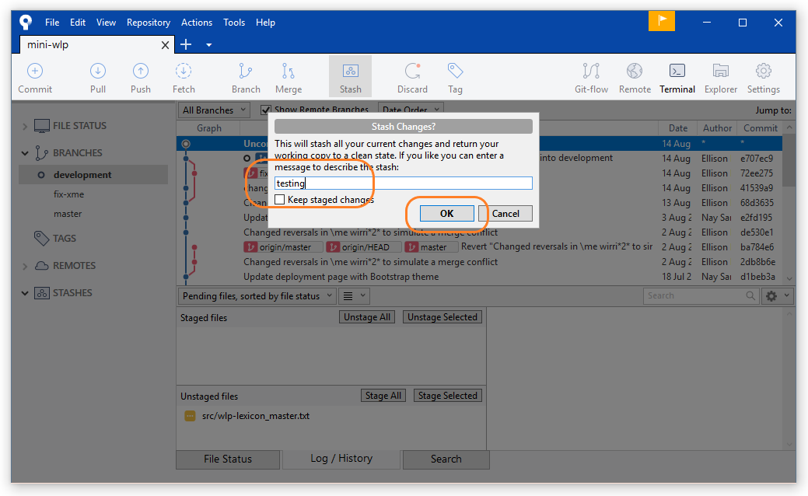

## Overview

Inevitably your workflow will be interrupted by problems. This tutorial will show you how to deal with the ones you will most likely come across:
* merge conflicts
* commits to be undone
* changes to be stashed

## How to Resolve Merge Conflicts

A `merge conflict` arises when you try to `merge` two branches with contradictory lines, which may arise when two collaborators edit the same line. This can be avoided if your team is clear on what lines each member is working on, but Sourcetree allows you to fix them before completing the merge.

As an example, let's make one edit: change one \xme line to a \syn line, and commit that (in a `fix-xme` branch)

Checkout `development` branch, refresh the repository status and pull the latest changes (1 has been flagged).

Now attempt to merge the `fix-xme` branch into `development branch. 

Sourcetree has detected a conflict, and has flagged them in the files. You can follow the window's advice to resolve them with Sourcetree, but you can also do it in the text editor.

Let's resolve them in the text editor. Open the file with the detected conflicts and search for the text "<<<<<<< HEAD". Each conflict will have this as an opening tag (`HEAD` refers to the remote version; i.e. the version that your collaborator(s) created). The closing tag will be labelled with the branch: the version that you created and are trying to merge with.

Confer with your collaborators on how you want to resolve the conflict, delete the tags and move on to the next conflict. When you have finished resolving the conflicts, save the file(s) and commit to the branch you are merging into (i.e. `development`). 

???
You may run into some weird files in your `File Status` tab: leave these unstaged, and make sure the file you want to stage has the **yellow square icon**. Keep an eye on the diff to make sure that you are committing the correct changes. 

Now you can commit (you can leave the commit message as is).

Congratulations! You have successfully merged your branches! It is now ahead of the `remote` branch by 2 commits(?), and you may now `push` it.

You can now check to see that your commit has made it on the Git web user interface.

## Undoing Commits

There are several ways you can undo a commit. 

You may right click your erroneous commit and select `Reverse commit...`: this will create a **new** `commit` that reverts your changes. Your `log` will still record your commit, and you can still go back to them. 

You can also undo specific 'hunks', by selecting `Reverse hunk` on a specific change. This will initiate a new process of `staging` and `committing`.

Alternatively, you can do a "hard reset" of the branch. Select the `commit` you want to revert to, right click, and select `Reset current branch to this commit`. For `local`-only (i.e. unpushed) commits, this will erase your history back to the `commit` you select. You may reset your branch to a remote commit, but this will not affect the commits on the remote repository.

## Stashing Changes

`Stashing` your changes is an alternative "saving" method of `committing`: you stow away the changes you have made without contributing them to the `branch`. This is necessary when you're switching between branches but don't want to `commit` something incomplete.

Select `Stash` on your uncommitted changes.

Give your stash a name and confirm.

Your stash will appear under `Stashes` in the sidebar, and you can go on to whatever you were doing. 

Later, when you return to working on your changes, you may choose to `Apply` them back to your branch (returning them to where you last left them), or simply `Delete` them from your branch altogether. 

