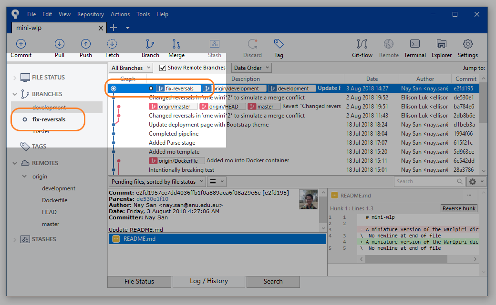

## Overview

This tutorial will show you how to use Git and Sourcetree to oversee your project's workflow.

The upshot of using Git is that you are able to work on your own part of the project **in parallel** with other members of your team, without worrying about conflicting versions of the project. To do this, each member of the team works on their own part of the project on their own `branch`: the `master branch` is the "trunk" of the project, and each `feature branch` is an offshoot where team members can work on some aspect in detail. Once work on these `feature branches` has been completed, they are merged back into the `master branch` (either directly, or via other `feature branches`). This way, work on the project can be compartmentalised while minimalising conflicts and localising the changes. 

From the Setup tutorial, you will have been able to `clone` the repository into your own machine. We will now go through how you can go about making changes.

## Step 0: `Refresh` and `Pull`

This will be what your interface will look like immediately after cloning.


`Refresh` your `repository status` by selecting it from this dropdown menu.


Now, you can `pull` changes from the `remote` repository into your `local` repository. `Pulling` a branch from the repository means that you are taking that branch and updating your own repository to match the contents of the branch you pulled. This is like **synchronising** your files between a cloud or online drive and your machine, except you can be quite specific about what you are pulling. 

For the tutorial, you can just select the `Pull` icon and confirm it on the pop-up window. If you have just `cloned` the repository (from the setup tutorial), `pulling` will not do anything, since both repositories will be exactly the same.


## Step 1: `Check out` and create branches

A `branch` is an instantiation of the repository that you can make changes on, without affecting the rest of the project. This project already has `remote branches` (they are not tracked by Sourcetree yet), which we can pull to make them `local`ly available. Moving from one `branch` to another is known as a `checkout`. 

On the left side pane, select `Remotes`, `origin`, and then double-click `development`. A window will pop up confirming that you would like to `Checkout New Branch`. Selecting `OK` with the box ticked, this will create a new `local` branch called `development`, which will have all the developments and changes from that branch on your computer.


Now, let's create a new `branch` from this `development` branch. To create a new `branch`, select the `branch` icon: give it a useful name that tells us exactly what it is for (we will use `fix-reversals`), and confirm. Your new branch will now appear on the left under your list of branches. You will now also see on the `log` that a new branch has been created.

Keep in mind that you should still try to minimise conflicts with other members of the team by restricting the scope of your changes to a single issue (e.g. only dealing with gloss lines in a dictionary file). Though conflicts will be inevitable, you can effectively pre-empt them by just sticking to your own part of the project!




## Step 2 Make changes

Now you can start to make changes to the file(s) in your repository. When you `cloned` your repository, you should have put it somewhere in your directory. **The `branch` you are currently on is the version of the repository that you can access.** If you checkout another branches, then the files will change accordingly. 

You can access your repository conveniently by clicking `Explorer`. 


For this tutorial, we'll use the following issue as an example. 

```
ISSUE:
We have `\gl` lines to indicate the gloss of a Warlpiri word, and `\rv` lines to indicate which English words should direct to this Warlpiri word in the 'reversed' dictionary. Historically, both functions were handled by the `gl` line, with `^` and `[]` used to indicate the `reversal` entry words, but this was deemed too clunky to validate. To address this, `\rv` lines were introduced: they are clones of `\gl` that have been reduced to limit the size of the reversed dictionary. The consequence is that `\gl` contains unnecessary reversal information and `\rv` is not always succinct. While this is not grammar-breaking, it is aesthetic clutter that can be fixed.
```


Of course, you can do this line-by-line, but you can also use script to help you out. How you can do this will be covered in another tutorial, but if you find yourself involved in reading or writing script, note the following:

* ensure the script is labelled clearly
* you can probably deduce what a script is doing by looking at the comments. (the green text prefaced by `#`).


It is usually helpful to keep a track of your changes as you are making them. [DiffMerge](https://sourcegear.com/diffmerge/) is a great desktop tool for this: simply supply the old file and the changed file, and it will show you what the changes are (this is called a `diff`). There are also online tools for doing this on the fly (copying and pasting chunks of text).


Once you have completed your changes for the day (or for the entire issue), make sure you keep a note of where those files are saved. Script files belong inside the `mini-wlp/scripts` folder, and lexicon files inside the `mini-wlp/src` folder.


After we have finished making our changes, we can bring all our changes from the test file into the master file.

## Step 3 `Commit` changes

When you have finished applying your changes to the branch, you should now `commit` these changes: i.e. confirm the contribution you wish to make to the `branch`. You can think of `committing` your changes as like an extra layer of "saving". 

Return to your Sourcetree window and you will see that the log records that there are `Uncommitted changes`. Head to `File Status`.


Here you will see the changes that Sourcetree has detected: a new `untracked` file called `clean-reversals.R` (our script) and a modified `wlp-lexicon_master.txt` (our lexicon file).


Notice that Sourcetree conveniently provides a `diff` of all the changes; you can stage as many or as few changes as you want, but most of the time, you will want to select `Stage All`. 


You may now `commit` the changes you have staged. Summarise those changes in your `commit` label, make sure that `Push changes immediately to - ` is **left unchecked**, and select `Commit`. 


You will now see your commit on the `log`!


## Step 4 `Checkout` `development` branch 

Our `fix-reversals` branch is now one commit ahead of `development` (where we branched off from in the first place). You may do as many commits as you wish on this `fix-reversals` branch, but eventually, it must merge back into the other branches. To do this, we first checkout the `development` branch.


## Step 5 `Pull` again

Refresh your repository status. Sourcetree will let you know if there is anything new to pull (in our case, nothing).


## Step 6 `Merging` branches

Now we will `merge` our two branches together: the changes in `fix-reversals` will now appear in `development`. If you did not need to pull anything in the last step, then this should run without any conflicts. 


## Step 8 `Push`

Now we are ready to `push` our files into the remote repository. Select `Push` and a popup window will ask you which branches you want to push. If you would like your `feature branch` to be available to our collaboraters, you may select that to be pushed to a remote branch of the same name. 

For our purposes, since our work has been merged into the `development` branch, we can simply select that.


## Step 9 Delete `branch`

If you did not `push` your feature branch (`fix-reversals`), and you have no use for it any more, you may now `delete` it. 

You cannot `delete` a branch that you are still on, so make sure you are on the `development` branch (or any other branch) when you `delete` your feature branch.


If you have `pushed` your feature branch, `deleting` your branch will only `delete` it *locally*: it will make no difference to the remote branch of the same name. `Deleting` a remote branch will require a `force delete`, which is very dangerous since this will affect how your collaborators use that branch.
