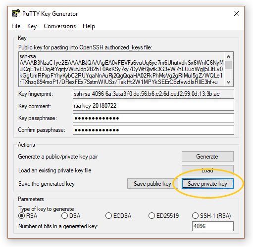

# Set up

## Overview

[Git](https://en.wikipedia.org/wiki/Git) is a version control system, which helps us keep track of and coordinate changes to various files.
GitLab is a Git hosting and web-based management service for projects using Git, and SourceTree is a multi-platform desktop client that makes interacting with Git and GitLab more convenient.
So roughly speaking, SourceTree is to Git (the technology) and GitLab (a service provider) what desktop clients such as Microsoft Outlook are to e-mail (the technology) for and Gmail (a service provider).

Like e-mail, there are many service providers and desktop clients. For the Warlpiri dictionary project, we use this particular combination. Thus, screenshots in this onboarding document refer to these particular software and services (please do let us know if these screenshots and instructions become out of date).

Lastly, if you do not already have a strong preference for a text editor (e.g. TextWrangler, Notepad++), we also recommend downloading and using Sublime Text. Unlike TextWrangler (macOS-only) or Notepad++ (Windows-only), Sublime Text is cross-platform, so we will also use Sublime Text in various screenshots below.

## Sublime Text

1. Go to <a href="https://www.sublimetext.com/3" target="_blank">https://www.sublimetext.com/3</a>, where you'll find various download links for Sublime Text. Click on the link relevant for your platform, e.g. OS X.

    If you are on a relatively-modern Windows machine (post-2010), you will likely want the 64 bit version.
    

### macOS

1. In your Downloads folder (or where you chose to download the file), you will see a disk image such as `Sublime Text Build 3176.dmg`. Open this file, and drag the `Sublime Text.app` contained in this image your Applications folder (a shortcut is usually provided within the image).
2. You can now unmount the disk image from your Devices list in the Finder window (the left menu where you would also unmount USB drives, etc.).
3. Go to your Applications folder and double click on `Sublime Text` to launch it.

### Windows

1. In your Downloads folder (or where you chose to download the file), you will see an application file named something along the lines of `Sublime Text Build 3176 x64 Setup.exe`. Open the setup wizard and follow the instructions to install it in your `Porgram Files`. Once complete, click `Finish`.
2. The program will be available in your `Start Menu`, and wherever you decide to create a shortcut. Click on the `Sublime Text` icon to launch it.

## SSH key generation

### macOS

To generate a new SSH key pair on OS X:

1. Open up the Terminal app and enter the following command (replacing first.last@university.edu.au with your e-mail):

    ssh-keygen -t rsa -C "first.last@university.edu.au" -b 4096

2. You will then be asked where you’d like to save the key. Hit Enter/Return to leave this as the default place (/Users/your-username/.ssh/id_rsa).

3. Enter a passphrase (minimum 5 characters) which you will be asked for anytime when interacting with the generated key, and hit Enter/Return.

4. You now need to copy and paste your public key to GitLab (you may skip ahead to create an account and do this step once you are prompted to enter your SSH key). To copy the public key (assuming you saved it in the default place), run the command:

    pbcopy < ~/.ssh/id_rsa.pub

### Windows

To generate an SSH key in Windows requires downloading a special program called `puttygen.exe`. 

1. Download `puttygen.exe` from "http://www.chiark.greenend.org.uk/~sgtatham/putty/latest.html" (get the 64-bit version unless you are using a very old machine). You can save it in your usual Downloads folder.

2. Open `puttygen.exe`. You should be faced with the following interface.

3. From the top menu item `Key`, make sure `SSH-2 RSA` is selected.

4. In the bottom-right corner, enter `4096` for the `Number of bits in generated key`.

5. Click generate and, as per the instructions on the interface, move the cursor around the blank space to provide some randomness.

6. Once generated, enter a `Key passphrase` which will be used to authenticate access to the private key in the future. There are no character restrictions, so use just use common sense as with generating any other password. 

7. Save the private key in your home directory (e.g. `C:\Users\your-name`, or `C:\Users\your-user-id`). This directory should also *contain* your `Documents` and `Downloads` folders.

8. Save the public key in the same place. 

9. Copy the *whole* public key in the Key area 'ssh-rsa ...'. You will need the copied key for the next step (configuring GitLab).

## GitLab

1. If you don't already have a GitLab.com account, go to <a href="https://gitlab.com/users/sign_in" target="_blank">https://gitlab.com/users/sign_in</a> and click the `Register` tab in order to create a GitLab account.

2. After the initial registration, you'll be asked to confirm your e-mail address. So check the inbox of the e-mail you signed up with for an e-mail from GitLab with a link to their confirmation page. 

3. After GitLab confirms your e-mail, you'll be taken to the Sign In page again, where you may now sign in with your newly-created account.

4. Now we need to enter your SSH key under your account. Got to your `User settings` by clicking the icon on the top right and selecting `Settings`. 

    
On the left sidebar, select `SSH Keys`. 

    
Copy your SSH key (from your generator), and paste it in the field labelled `Typically starts with "ssh-rsa ..."`. Enter a name for your key and select `Add key`.

## SourceTree

1. Go to <a href="https://www.sourcetreeapp.com/" target="_blank">https://www.sourcetreeapp.com/</a>, where you'll be able to download SourceTree for your platform directly from the landing page (screenshot below). Otherwise click "Also available for ...".
    
    
### macOS

1. You will have downloaded a file named `Sourcetree_X.Y.Z.zip` (e.g. `Sourcetree_2.7.6.zip`), into your Downloads folder (or, elsewhere if you had specified the destination). Unzip this file, and drag the resulting `Sourcetree.app` into your Applications folder.
2. Go to your Applications folder and double click the `Sourcetree` application icon to launch it.

### Windows

1. You will have downloaded a file named `SourceTreeSetup-X.Y.Z.exe` (e.g. `SourceTreeSetup-2.6.10`), in your Downloads folder (or, elsewhere if you had specified another destination). Open it, and it will automatically launch SourceTree.

2. If/when SourceTree says that it cannot find an installation of Git, click the option to install an `Embedded version of Git`.

3. Enter the passphrase you came up with when you generated the SSH key.

## Creating a copy of `mini-wlp`

In this section, we will introduce some Git terminology while also setting up your own copy of the `mini-wlp` repository for the remaning part of the onboarding exercises. Iin fact, we'll create *two* copies (we'll clarify this shortly).

### Create a fork of `coedl/mini-wlp`

First, go to <a href="https://gitlab.com/coedl/mini-wlp" target="_blank">https://gitlab.com/coedl/mini-wlp</a>. 

A common way to refer to a Git repository hosted on the web is via the host (e.g. GitLab, GitHub), the owner (e.g `coedl`), and the name of the project (e.g. `mini-wlp`): `https://gitlab.com/coedl/mini-wlp`.
As a new member, you are currently unlikely to have *write* access to this `mini-wlp` owned by `coedl`.

However, as `coedl/mini-wlp` is a public repository, everyone has *read* access. 
So we can create a copy (a fork) by forking `coedl/mini-wlp` into your newly-created account, i.e. creating `your-user-name/mini-wlp`, to which you do have write access (note 'fork', just as 'copy', is both a noun and a verb; this type of <a href="https://en.wikipedia.org/wiki/Conversion_(word_formation)" target="_blank">conversion</a> will be a recurring theme).

1. To create a fork, first go to the address of the repository you wish to fork, i.e. <a href="https://gitlab.com/coedl/mini-wlp" target="_blank">https://gitlab.com/coedl/mini-wlp</a>, where at you will find a `Fork` button on the project home page. 
    
2. You will be asked the namespace in which you want the fork to be created. Some accounts have multiple (e.g. personal vs. company, etc.), but your newly-created account will only have one, i.e. `your-user-name`. Click on the only available namespace to continue.
    
3. You will now be presented with the fork you have just created, i.e. `your-user-name/mini-wlp`. Notice that the address also reflects the ownership, which means a) you are free to modify this repository however you wish and b) these modifications will have no effect the original repository, `coedl/mini-wlp`.
    

### Clone `your-user-name/mini-wlp` to your computer

The 2nd copy of `mini-wlp` you will create is a *local* version of the GitLab repository `your-user-name/mini-wlp`.
Creating this local version is cloning `your-user-name/mini-wlp` (or creating a clone thereof), and we will use SourceTree to help us do this.

***Side note.*** Fork vs. clone meant different concepts historically (whether or not *technically* git implemented them differently), where 'fork' meant that you were creating a copy whose changes will not be merged back into the original repository, while 'clone' denoted that they would be (and you had permission to do this merge).

However, this distinction becomes less clear-cut with the advent of hosts such as GitHub and GitLab. For example, GitLab allows for forkers to request that changes in the forked repository be merged back into the original repository (via a merge request), so the historical concept of 'fork' may not always hold.

In our case, this distinction does hold, as we will only send changes you do on your cloned copy of `your-user-name/mini-wlp` back to the your forked copy on GitLab (and you have permission to do so, since you own it).
These same changes received by your forked copy on GitLab, however, will not be merged back into `coedl/mini-wlp`, as we created the fork just for the onboarding exercise.

1. Retrieve the address of your forked `mini-wlp` repository, by going to the main page of your repository (e.g. `https://gitlab.com/your-user-name/mini-wlp`), clicking `SSH` in the dropdown on the left of the address, and clicking the `Copy URL to clipboard` icon on the right of it:
    

2. Switch from your browser to the SourceTree application. Click the `File` menu, then click `New...`, and then `Clone from URL`. This will present you with the forms below. Paste the URL copied in step 1 into the `Source URL` field, and the rest should be automatically completed by SourceTree for you (you may need to enter your GitLab account password). The default settings will suffice for this onboarding exercise. **Note.** Do take note of *where* the `Destination Path` is.
    

3. After SourceTree has completed cloning, it will open a new window showing the `History` of the repository:
    

4. In your Finder (macOS) or Windows Explorer (Windows), you may browse to location of the `Destination Path` (e.g. `/Volumes/data/mini-wlp` in our Clone a repository form in Step 2), and see the files associated with the repository:
    

Congrats! `r "\U1F389\U1F389\U1F389"` You are now ready to start making changes! Head to Git Workflow to for a tutorial of how to work with Git.

